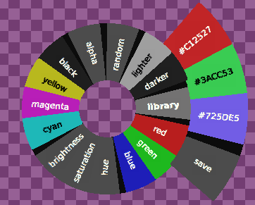
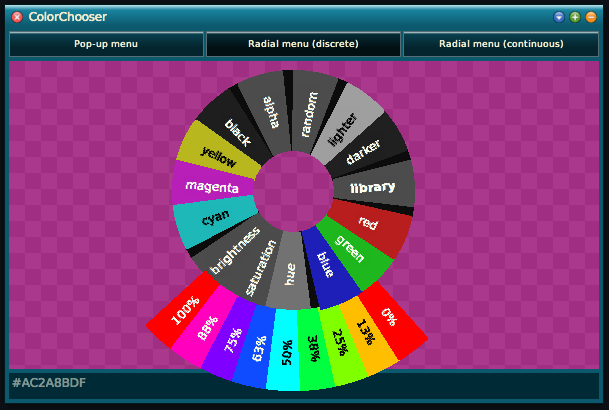
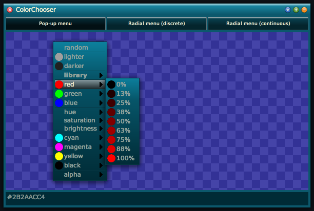
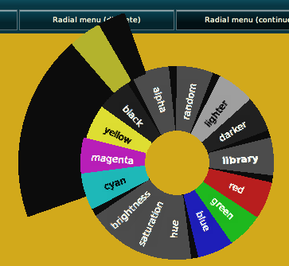

# ColorContextMenu – Library and Application Example of a Radial Menu for Squeak

[](https://github.com/LinqLover/ColorContextMenu/actions/workflows/main.yml)

A simple color chooser tool for [Squeak/Smalltalk](https://squeak.org/) for the purpose of comparing several kinds of menu types. This solution focuses on radial menus. The repository also includes **a radial menu API** (`RadialMenuMorph`) that is widely compatible to the standard `MenuMorph` interface.

This project has originally been developed as part of a study exercise about User Interface Programming, offered by the Computer Graphics Systems Group at HPI ([@hpicgs](https://github.com/hpicgs)).

For more information on our repository, just check it our or take a look into our [closed and unclosed features](https://github.com/LinqLover/ColorContextMenu/issues?q=+)!

<table>
  <tr>
    <td align="center"><a href="img/screenshot-library.png"></a></td>
    <td align="center"><a href="img/screenshot-hue.png"></a></td>
  </tr>
  <tr>
    <td align="center"><a href="img/screenshot-classic.png"></a></td>
    <td align="center"><a href="img/screenshot-radial.png"></a></td>
  </tr>
 </table>

## Development

Clone the repository using [Squot](https://github.com/hpi-swa/Squot).

## Installation

```smalltalk
Metacello new
	baseline: 'ColorContextMenu';
	githubUser: 'LinqLover' project: 'ColorContextMenu' path: 'src';
	load.
```

## Usage

```smalltalk
ColorChooser open.
```
